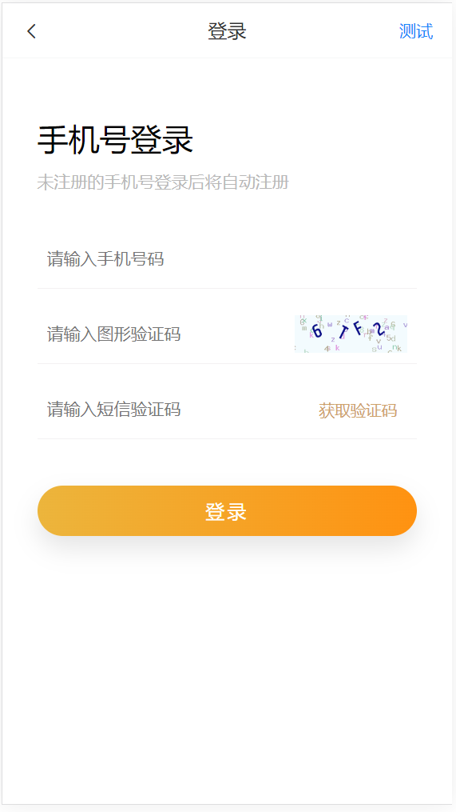

# 智慧商品

## 1、描述

一个按照b站上黑马Vue教学视频做的智慧商品项目，用来练手的，顺便练习一下git命令。项目主要用到Vue2框架，用Vue CLI脚手架构建，用到VueRouter配置路由、vuex状态管理工具和vant组件库等。

## 2、Demo 

​	主界面

​	登录界面

## 3、技术栈

node.js

npm

axios

vue2

## 4、技术说明

安装所有依赖

`npm -i`

运行

`npm run serve`
